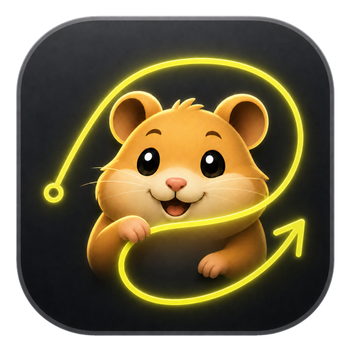
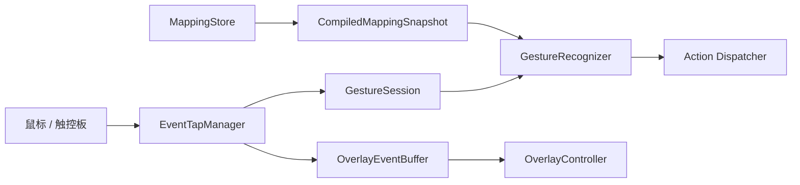

<p align="center">
  
</p>

<h1 align="center">iGestures</h1>

<p align="center">
  原生、轻量的 macOS 鼠标手势工具。
</p>

<p align="center">
  <a href="https://github.com/ron159/iGestures/releases/latest"></a>
  
  
  <a href="LICENSE"></a>
</p>

iGestures —— 按住绘制，松开执行，就是如此简单高效。

## ✨ 功能亮点

- 🖱️ **自由录制**：训练任意单笔轨迹，可直接录制任意物理鼠标按键作为触发键。
- 🗂️ **应用管理**：按全局、应用分组和单个应用管理手势；匹配优先级为
  `单个应用 → 应用分组 → 全局`。

- 🔎 **快捷动作库**：按窗口、浏览器、网站、访达、桌面、编辑、媒体和自动化脚本
  分类搜索，支持收藏、最近使用和保存自定义预设，主动作与第二触发动作共用。

- 🎯 **丰富触发**：支持 Repeat Mode、触控板修饰键手势和三档识别灵敏度。
- 🎨 **即时反馈**：支持多显示器轨迹覆盖层、识别结果提示和可选触觉反馈。
- 🛡️ **可靠与私密**：映射采用版本化 JSON、原子写入和损坏恢复；不记录轨迹、
  键入文本或窗口内容。


## 📦 下载与使用

前往 [GitHub Releases](https://github.com/ron159/iGestures/releases/latest)
下载最新的 `iGestures-<版本>-macOS-arm64.zip`。运行环境为：

- macOS 26 或更高版本；
- Apple Silicon Mac（arm64）。

社区版本使用本地临时签名，首次启动如被阻止，请在 “系统设置 → 隐私与安全性”中选择“仍要打开”，然后在 iGestures 权限页按提示 授予辅助功能、输入监听和事件发送权限。
首次运行控制“系统事件”、访达或终端的 AppleScript 时，macOS 还会针对目标应用
请求“自动化”权限。

可使用 Release 附带的校验文件验证下载内容：

```shell
shasum -a 256 -c iGestures-<版本>-macOS-arm64.zip.sha256
```

## 🛠️ 编译

需要 Xcode 27 和 Swift 6。使用 Xcode 打开 `iGestures.xcodeproj`，选择共享 Scheme
`iGestures` 即可构建；也可以使用命令行：

```shell
export DEVELOPER_DIR=/Applications/Xcode-beta.app/Contents/Developer

xcodebuild \
  -project iGestures.xcodeproj \
  -scheme iGestures \
  -configuration Release \
  -destination 'platform=macOS,arch=arm64' \
  build
```

运行核心检查：

```shell
swift run -c release iGesturesCoreChecks
```

## 🏗️ 架构简介



- **低延迟输入**：Event Tap 在专用高优先级 RunLoop 上处理事件，未形成手势的输入
  会 Fail-open 回放。
- **轻量识别**：轨迹归一化为固定点数后进行模板匹配，不依赖云端服务。
- **线程隔离**：设置通过不可变映射快照发布到事件线程，存储由 actor 隔离。
- **原生界面**：SwiftUI 负责设置和管理，AppKit 负责跨显示器轨迹覆盖层。

## 📄 开源协议

Copyright © 2026 ron159.

iGestures 采用 [GNU General Public License v3.0 or later](LICENSE)。
你可以使用、修改和分发本项目；对外分发原版或衍生版本时，需要继续按照
GPL-3.0-or-later 提供对应源代码。
