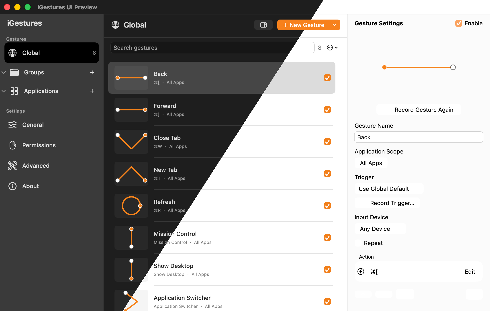
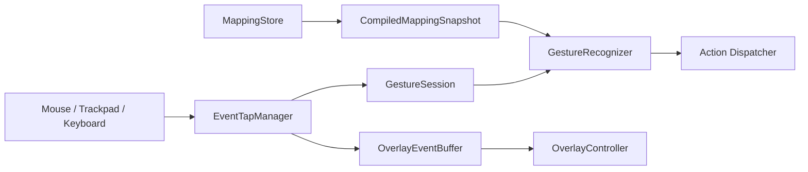

<p align="center">
  
</p>

<h1 align="center">iGestures</h1>

<p align="center">
  A native, lightweight mouse gesture tool for macOS.
</p>

<p align="center">
  English | <a href="README_CN.md">简体中文</a>
</p>

<p align="center">
  <a href="https://github.com/ron159/iGestures/releases/latest"></a>
  
  
  <a href="LICENSE"></a>
</p>

Hold, draw, and release—iGestures handles the rest. It turns a mouse or keyboard
trigger into a fast, intuitive command, with all processing kept on your Mac.

## Screenshot

<p align="center">
  
</p>

<p align="center">
  <sub>Dark and light appearances with global gestures, searchable mappings, and inline action editing.</sub>
</p>

## Why iGestures

Keyboard shortcuts are fast but hard to remember; fixed mouse buttons are
intuitive but limited. iGestures combines the two: draw a shape you recognize
and run the right action in the right application without leaving your current
workflow.

## ✨ Feature Highlights

- 🖱️ **Free-form recording**: Train any single-stroke path and record any
  physical mouse button directly as the trigger.
- 🗂️ **Application management**: Manage gestures globally, by application
  group, and by individual application; matching follows
  `Application → Group → Global`.
- 🔎 **Quick action library**: Search Window, Browser, Website, Finder, Desktop,
  Editing, Media, and Automation Scripts categories; supports favorites, recent
  actions, and saved custom presets shared by primary and secondary trigger
  actions.
- 🎯 **Flexible triggers**: Supports Repeat Mode, trackpad modifier gestures,
  and three recognition sensitivity levels.
- 🎨 **Immediate feedback**: Multi-display gesture overlays, recognition result
  prompts, and optional haptics.
- 🛡️ **Reliable and private**: Versioned JSON, atomic writes, and corruption
  recovery; gesture paths, typed text, and window content are not recorded.

## Permissions

iGestures asks for macOS permissions only for the actions that need them.

| Capability | macOS permission | When it is used |
| --- | --- | --- |
| Observe configured triggers | Input Monitoring | While gesture recognition is enabled |
| Send shortcuts and clicks, and control the interface | Accessibility and event posting | When executing your chosen action |
| Control System Events, Finder, Terminal, or another app | Automation | The first time an AppleScript targets that app |

## Install

### Option 1: Download a release

Requires macOS 26 or later on an Apple Silicon Mac. Download the latest
`iGestures-<version>-macOS-arm64.dmg` from
[GitHub Releases](https://github.com/ron159/iGestures/releases/latest), open
it, and drag iGestures into Applications. After installation, **About → Check
for Updates** can download, verify, and open future DMG releases directly.

If the first launch is blocked, open **System Settings → Privacy & Security**,
click **Open Anyway**, then complete the permission checklist in iGestures.

Verify the download with the checksum shipped beside the DMG:

```shell
shasum -a 256 -c iGestures-<version>-macOS-arm64.dmg.sha256
```

### Option 2: Build from source

Requires Xcode 27 and Swift 6:

```shell
git clone https://github.com/ron159/iGestures.git
cd iGestures

export DEVELOPER_DIR=/Applications/Xcode-beta.app/Contents/Developer
xcodebuild \
  -project iGestures.xcodeproj \
  -scheme iGestures \
  -configuration Release \
  -destination 'platform=macOS,arch=arm64' \
  build
```

Run the optimized core checks with:

```shell
swift run -c release iGesturesCoreChecks
```

## Architecture



- The event tap processes input on a dedicated high-priority run loop and
  replays input when no gesture forms.
- Recognition normalizes strokes to fixed-size local templates; no cloud model
  is involved.
- Immutable mapping snapshots are published to the event thread, while
  persistence is actor-isolated.
- SwiftUI powers settings and AppKit handles low-level input and multi-display
  overlays. The project has no third-party runtime dependencies.

## Notes and limitations

- Current release artifacts target Apple Silicon only and require macOS 26+.
- Ad-hoc signatures can change between builds, so macOS may ask you to grant
  permissions again after an upgrade.
- Script actions can control other apps or run shell commands; inspect and
  confirm scripts before enabling them.

## Feedback

Bug reports and ideas are welcome in
[GitHub Issues](https://github.com/ron159/iGestures/issues).

## Acknowledgements

Thanks to [MacGesture/MacGesture](https://github.com/MacGesture/MacGesture) and
[WGestures 2](https://www.yingdev.com/projects/wgestures2) for the inspiration
and reference they provided to this project.

## License

Copyright © 2026 ron159.

iGestures is licensed under the
[GNU General Public License v3.0 or later](LICENSE). If you distribute the
original project or a derivative, you must continue to provide the corresponding
source under GPL-3.0-or-later.
