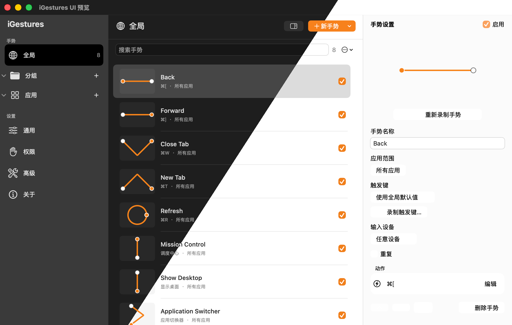
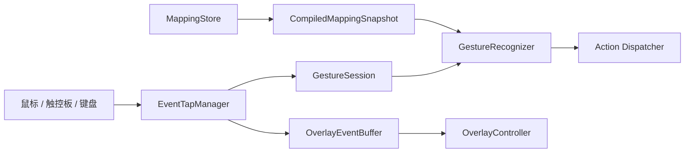

<p align="center">
  
</p>

<h1 align="center">iGestures</h1>

<p align="center">
  原生、轻量的 macOS 鼠标手势工具。
</p>

<p align="center">
  <a href="README.md">English</a> | 简体中文
</p>

<p align="center">
  <a href="https://github.com/ron159/iGestures/releases/latest"></a>
  
  
  <a href="LICENSE"></a>
</p>

按住、绘制、松开，剩下的交给 iGestures。把鼠标或键盘触发键变成快速、直观的命令，所有处理都留在你的 Mac 上。

## 示例截图

<p align="center">
  
</p>

<p align="center">
  <sub>暗色与亮色外观，以及全局手势、映射搜索与行内动作编辑。</sub>
</p>

## 为什么选择 iGestures

键盘快捷键很快，却不容易记住；固定鼠标按键很直观，能做的事情又有限。iGestures
把两者结合起来：画出你熟悉的形状，在正确的应用中执行正确的动作，不用离开当前
工作流。

## ✨ 功能亮点

- 🖱️ **自由录制**：训练任意单笔轨迹，可直接录制任意物理鼠标按键作为触发键。
- 🗂️ **应用管理**：按全局、应用分组和单个应用管理手势；匹配优先级为 `单个应用 → 应用分组 → 全局`。
- 🔎 **快捷动作库**：按窗口、浏览器、网站、访达、桌面、编辑、媒体和自动化脚本
  分类搜索，支持收藏、最近使用和保存自定义预设，主动作与第二触发动作共用。
- 🎯 **丰富触发**：支持 Repeat Mode、触控板修饰键手势和三档识别灵敏度。
- 🎨 **即时反馈**：支持多显示器轨迹覆盖层、识别结果提示和可选触觉反馈。
- 🛡️ **可靠与私密**：映射采用版本化 JSON、原子写入和损坏恢复；不记录轨迹、
  键入文本或窗口内容。

## 权限

iGestures 只在相关功能需要时请求 macOS 权限。

| 功能                | macOS 权限  | 使用时机                  |
| ----------------- | --------- | --------------------- |
| 观察已配置的触发键         | 输入监听      | 启用手势识别时               |
| 发送快捷键、点击并控制界面     | 辅助功能与事件发送 | 执行你选择的动作时             |
| 控制系统事件、访达、终端或其他应用 | 自动化       | AppleScript 首次控制目标应用时 |

## 安装

### 方式一：下载发布版本

需要 macOS 26 或更高版本以及 Apple Silicon Mac。前往
[GitHub Releases](https://github.com/ron159/iGestures/releases/latest) 下载最新的
`iGestures-<版本>-macOS-arm64.zip`。

首次启动如被阻止，请打开 **系统设置 → 隐私与安全性**，点击**仍要打开**，然后在 iGestures 中完成权限清单。

使用 ZIP 旁附带的校验文件验证下载内容：

```shell
shasum -a 256 -c iGestures-<版本>-macOS-arm64.zip.sha256
```

### 方式二：从源码构建

需要 Xcode 27 和 Swift 6：

```shell
git clone https://github.com/ron159/iGestures.git
cd iGestures

export DEVELOPER_DIR=/Applications/Xcode-beta.app/Contents/Developer
xcodebuild \
  -project iGestures.xcodeproj \
  -scheme iGestures \
  -configuration Release \
  -destination 'platform=macOS,arch=arm64' \
  build
```

运行优化后的核心检查：

```shell
swift run -c release iGesturesCoreChecks
```

## 架构



- Event Tap 在专用高优先级 RunLoop 上处理输入；未形成手势时会回放原始输入。
- 识别器把轨迹归一化为固定大小的本地模板，不依赖云端模型。
- 不可变映射快照发布到事件线程，持久化存储由 actor 隔离。
- SwiftUI 负责设置界面，AppKit 负责底层输入和多显示器覆盖层；项目没有第三方运行时依赖。

## 说明与限制

- 当前发布包只支持 Apple Silicon，并要求 macOS 26 或更高版本。
- 临时签名可能随构建变化，升级后 macOS 可能要求重新授予权限。
- 脚本动作可以控制其他应用或运行 Shell 命令；启用前请先检查并确认脚本内容。

## 反馈

Bug 与建议欢迎提交到
[GitHub Issues](https://github.com/ron159/iGestures/issues)。

## 开源协议

Copyright © 2026 ron159.

iGestures 采用 [GNU General Public License v3.0 or later](LICENSE)。如果对外分发
原项目或衍生版本，需要继续按照 GPL-3.0-or-later 提供对应源代码。
